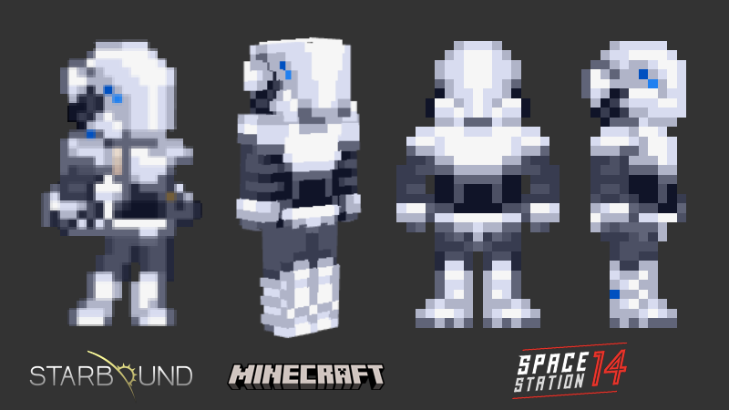

# Alta SS14 Sprites

A public repository for [alta](https://github.com/Ceterai/Enternia/wiki/Alta)-related sprites for **Space Station 14**.

These are meant to be alta items ported from [My Enternia](https://steamcommunity.com/sharedfiles/filedetails/?id=2006558650) to SS14.

## Sprites

###  [Alta Security Set](https://github.com/Ceterai/Enternia/wiki/Security-Set)

Parts:

- [ V1V Set](skins/security/full/equipped-OUTERCLOTHING.png)
  - [ V1V Helmet](skins/security/helmet/equipped-HELMET.png) - corresponds to  [Security Helmet](https://github.com/Ceterai/Enternia/wiki/Security-Helmet)
  - [ V1V Armor](skins/security/armor/equipped-BODY.png) - corresponds to  [Security Armor](https://github.com/Ceterai/Enternia/wiki/Security-Armor)
    - [ V1V Guard](skins/security/guard/equipped-BODY.png)
    - [ V1V Sleeves](skins/security/sleeves/equipped-HANDS.png)
    - [ V1V Gloves](skins/security/gloves/equipped-HANDS.png)
  - [ V1V Greaves](skins/security/greaves/equipped-LEGS.png) - corresponds to  [Security Greaves](https://github.com/Ceterai/Enternia/wiki/Security-Greaves)
    - [ V1V Leggings](skins/security/leggings/equipped-LEGS.png)
    - [ V1V Bots](skins/security/bots/equipped-FEET.png)
- [ V1V Inner Set](skins/security/full/equipped-OUTERCLOTHING.png)
  - [ V1V Helmet](skins/security/helmet/equipped-HELMET.png)
  - [ V1V Jumpsuit](skins/security/jumpsuit/equipped-INNERCLOTHING.png)
    - [ V1V Gloves](skins/security/gloves/equipped-HANDS.png)
    - [ V1V Bots](skins/security/bots/equipped-FEET.png)
- [ V1V Outer Set](skins/security/full/equipped-OUTERCLOTHING.png)
  - [ V1V Helmet](skins/security/helmet/equipped-HELMET.png)
  - [ V1V Hardsuit](skins/security/hardsuit/equipped-OUTERCLOTHING.png)

Comparison:

